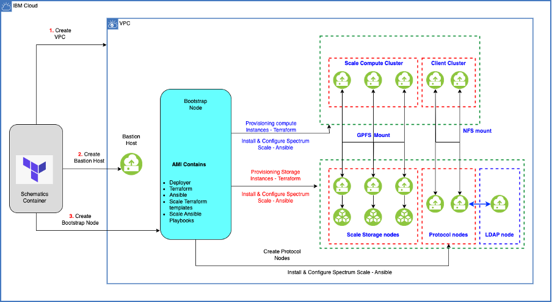

---

copyright:
  years: 2023, 2024
lastupdated: "2024-06-12"

keywords: 

subcollection: storage-scale

---

{:shortdesc: .shortdesc}
{:codeblock: .codeblock}
{:screen: .screen}
{:external: target="_blank" .external}
{:pre: .pre}
{:tip: .tip}
{:note: .note}
{:important: .important}
{:faq: data-hd-con
{:step: data-tutorial-type='step'}
{:table: .aria-labeledby="caption"}

# Enabling Cluster Export Services
{: #config-ces-integration-ldap-authentication}

Cluster Export Services (CES) is a key component of the {{site.data.keyword.scale_full_notm}} architecture, which is designed to enable access to data stored in the Scale-out File and Object Storage (Storage Scale) system. CES plays a critical role in providing efficient and versatile data access to meet the diverse needs of modern enterprises.

CES is designed to offer versatile access methods. This flexibility allows organizations to support a wide range of applications and use cases.

Enabling colocation designates the subset of Storage server as protocol nodes. If disabled, the protocol nodes are created on a dedicated virtual server irrespective of storage type.

The colocation feature avoids the need to provision extra virtual servers and improves the performance. It is also supported on Bare Metal servers.

{: caption="Figure 1.  CES node on Storage Scale" caption-side="bottom"}

## Before you begin
{: #beforeyoubegin-config-ces}

Before you begin, review the following information:

1.	Make sure to complete the steps for [Getting started with IBM Storage Scale](/docs/storage-scale?topic=storage-scale-getting-started-tutorial).

2.	Learn more about cluster export service by using the link, [how CES works](/docs/storage-scale?topic=storage-scale-config-ces-integration-ldap-authentication#beforeyoubegin-config-ces)

## Configuring CES deployment
{: #procedureconfig-ces-deploy}

To enable the CES feature on a Storage Scale cluster, the following variables need to be defined in [your workspace](/docs/storage-scale?topic=storage-scale-creating-workspace):

|CES Variable|	Description|	Example value|
|-------------|------------|--------------|
|`vpc_protocol_cluster_private_subnets_cidr_blocks`|The CIDR block is required for the creation of the protocol node's private subnet	|`["10.241.17.0/24"]`|
|`vpc_protocol_cluster_dns_domain`|IBM Cloud DNS Services domain name to be used for the protocol nodes.	|`cesscale.com`|
|`protocol_vsi_profile`	|The virtual server instance profile type name is used to create the protocol cluster nodes. For more information, see Instance Profiles. |`cx2-32x64`|
|`total_protocol_cluster_instances`|	protocol nodes	|`2`  |
|`custom_file_shares`	|Mount points and sizes in GB of file shares that can be used to customize shared file storage layout. Provide the details for up to 5 shares.	|`[{ mount_path = "/mnt/binaries", size = 100 }, { mount_path = "/mnt/data", size = 100 }]`|
|`total_client_cluster_instances`	|Client cluster node count	|`2`  |
|`client_vsi_osimage_name`	|Image name to use for provisioning the client cluster instances.	| `ibm-redhat-8-8-minimal-amd64-3`  |
|`client_vsi_profile`	|The virtual server instance profile type name is used to create the client cluster nodes. For more information, see [Instance Profiles](/docs/vpc?topic=vpc-profiles&interface=ui).|`cx2-2x4` |
|`vpc_client_cluster_dns_domain`	|IBM Cloud DNS domain name to be used for client cluster.	|`clientscale.com`|
|`client_cluster_key_pair`	|Name of the SSH key configured in your IBM Cloud account that is used to establish a connection to the Client cluster nodes. Make sure that the SSH key is present in the same resource group and region where the cluster is provisioned. If you do not have an SSH key in your IBM Cloud account, create one by using the SSH keys instructions.|`["my-ssh-key1", "my-ssh-key2"]` |
|`colocate_protocol_cluster_instances`|Enable this to use storage instances as protocol instances	|false |
{: caption='CES Variables'}

The successful scale deployment with the CES feature enabled consists of different clusters:

*   Storage cluster with defined storage and CES protocol nodes.
*   Client cluster with defined client nodes that mounts file shares that are exported by protocol nodes with NFS protocol.
*   (Optional) Compute cluster with defined compute nodes.

## Verifying CES on the file system
{: #verify-ces}

1.	Log in to any of the clusters (storage or compute nodes) by running the following SSH command:

    ```
    ssh -J root@BASTION_SERVER vpcuser@STORAGE_NODE
    ```

2.	To view the cluster shared root configuration on the storage cluster, run the following command:

    ```
    mmlsconfig cesSharedRoot
    ```

3.	To list the protocol nodes in the cluster, run the following command:

    ```
    mmces node list
    ```

4.	To view the protocol cluster information, use the mmlscluster command:

    ```
    mmlscluster --ces
    ```

5.	Use the service list command that provides comprehensive list of the services that are running in the CES cluster, use --verbose and -a flag for detailed information:

    ```
    mmces service list --verbose -a
    ```

6.	Use the mmuserauth command to view the details on the type of authentication used for CES:

    ```
    mmuserauth service check
    ```

7.	Use the mmnfs export command to add, change, list, load, or remove NFS export declarations for IP addresses on nodes that are configured as CES types. Use list to view the current NFS exports:

    ```
    mmnfs export list
    ```
    
8.	Use the mmlsquota command to display quota information for a user, group, or file set. The -j flag is used for displaying the quota for file set in a file system.

    ```
    mmlsquota -j data FILESYSTEM
    ```

The CES feature is only available with the custom image that is provided by the solution.
{: note}

