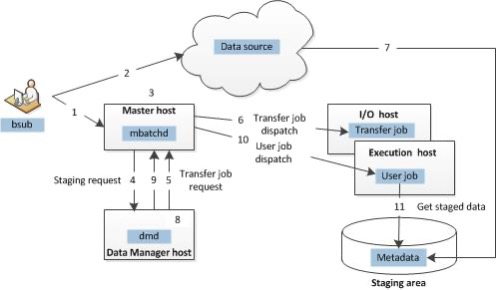
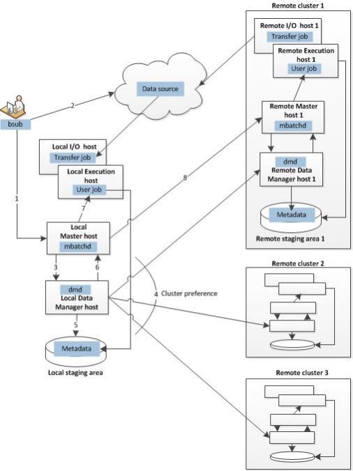

---

copyright:
  years: 2022, 2023
lastupdated: "2023-12-14"

keywords: 

subcollection: storage-scale

---

{:shortdesc: .shortdesc}
{:codeblock: .codeblock}
{:screen: .screen}
{:external: target="_blank" .external}
{:pre: .pre}
{:tip: .tip}
{:note: .note}
{:important: .important}
{:faq: data-hd-content-type='faq'}
{:ui: .ph data-hd-interface='ui'}
{:cli: .ph data-hd-interface='cli'}
{:api: .ph data-hd-interface='api'}
{:table: .aria-labeledby="caption"}

# Data Transfer
{: #data-transfer}

## Overview
{: #overview}

It is hard to choose a tool to complete a task when there are many tools available in the market, it gets even more challenging when data transfer between cloud locations or on-premises to the cloud or running jobs with data residing in different locations.

There are several options available for data transfer in and out of the {{site.data.keyword.cloud_notm}} and how to run a job with data residing in different cloud locations. The pros and cons of each option are listed and also the tools suitable for job or use case.
 
The options are classified into four categories:
           
1.	IBM Spectrum LSF Data Manager
2.	Spectrum Scale AFM
3.	IBM Aspera
4.	Collection of generic utilities
    a)	SCP
    b)	RSYNC
    c)	RClone
    d)	Ansible playbook
 
## IBM Spectrum LSF Data Manager
{: #lsf-data-manager}

When large amounts of data are required to complete computations, LSF Data Manager enables your applications to access the data they require to complete computations, unhindered by the location of the data for the concerned application. LSF Data Manager solves the problem of data locality by staging required data files as closely as possible to your applications. You can stage input data from an external source repository to the cluster execution hosts and stage output data asynchronously to an external destination repository after job completion.

Every LSF cluster that shares a staging area also communicates with the same LSF data manager instance. The clusters query the data manager for the availability of data files.

If the files are not in the cache, the LSF data manager stages them and notifies the cluster when the requested data for the job is ready. After files are staged, the clusters can retrieve them from the staging area by consulting the data file information that is stored in the staging area by the LSF data manager.
  
*   Single-cluster implementation
    A typical single-cluster implementation of LSF Data Manager consists of a data source, an LSF management host, a data manager host, I/O hosts, and execution hosts. Each component works together to accomplish the task of staging data and submitting jobs with data requirements.

    {: caption="Figure 1. Single-cluster" caption-side="bottom"}


*   LSF multicluster capability implementation
    A typical LSF multicluster capability implementation of LSF Data Manager has a queue configuration that is not a remote-only queue. Each component works together to accomplish the task of staging data and submitting jobs with data requirements.

    {: caption="Figure 1. Multiple-cluster" caption-side="bottom"}


### Pros 
{: #pros-data-mgr}

Able to run the jobs with data resists in different locations.

### Cons
{: #cons-data-mgr}

Data dependency for the LSF cluster to be identified, what exact data is required to complete the job. If it's applications, if it is libraries and any other dependency, presumably those are already living in the cloud, but if it is the actual input data set or any reference data set that it might need, you must point that out as part of your job submission.

### Limitations
{: #limit-data-mgr}

*   Both the data source and destination should have an LSF cluster.

### Licensing
{: #lic-data-mgr}

*   No separate license is required for IBM LSF Data Manager if you have an IBM LSF Data Manager Server License

To learn more about IBM Spectrum LSF Data Manager, click [here](https://www.ibm.com/docs/en/spectrum-lsf/10.1.0?topic=lsf-data-manager).
 

## IBM Storage Scale Active File Management (AFM)
{: #storage-scale-afm}

Active File Management (AFM) enables the sharing of data across clusters, even if the networks are unreliable or have high latency.

An AFM fileset can be enabled on a GPFS-independent fileset. Each fileset has a distinct set of AFM attributes. An IBM Storage Scale cluster that contains AFM filesets is called a cache cluster. A cache cluster has a relationship with another remote site called the home, where either the cache or the home can be the data source or destination.

AFM uses the NFSv3 protocol or the NSD protocol for communication between clusters.

AFM can create associations between IBM Storage Scale clusters or between IBM Storage Scale clusters and NFS data sources.

With AFM, you can implement a single namespace view across sites around the world by making your global namespace truly global.
  
### Pros 
{: #pros-storage-scale}

The Pros of this approach include:

*   Users can build a common namespace across locations and automate the flow of file data.
*   Users can duplicate data for disaster recovery purposes without suffering from wide area network (WAN) latencies.
*   Individual files in the AFM filesets can be compressed. Compressing files saves disk space. For more information, see File Compression.
*   Snapshot data migration is also supported. For more information, see ILM for snapshots.
*   Namespace replication with AFM occurs asynchronously so that applications can operate continuously on an AFM fileset without network bandwidth constraints
 
### Cons
{: #cons-storage-scale}

The Cons of this approach include:

*  AFM does not offer any feature to check the consistency of files across source and destination. However, after files are replicated, you can use any third-party utility to check for consistency.

### Limitation
{: #limits-storage-scale}

*   AFM can be enabled on GPFS-independent filesets only. A dependent fileset can be linked under an AFM fileset, but only up to one level below the AFM-independent fileset. The dependent fileset does not allow nested dependent filesets under the AFM-independent fileset.
*   An AFM cache site can be configured to connect with any home site that provides access to the home data through the NFSv3 protocol. The home site is not required to be an IBM Storage Scale; the mmafmconfig command cannot be issued on the AFM home site. Therefore, the AFM cache site cannot cache or update extended attributes (EAs), access control lists (ACLs), file spareness, or AFM psnaps.
*   The mmclone command is not supported on the AFM cache.

To learn more about the limitations, click [here](https://www.ibm.com/docs/en/storage-scale/5.1.8?topic=limitations-afm-afm-dr).

### Licensing
{: #license-storage-scale}

*  No separate license is required for IBM Storage Scale AFM if you have an IBM Storage Scale Server License

To learn more about IBM Storage Scale Active File Management (AFM), click [here](https://www.ibm.com/docs/en/storage-scale/5.1.8?topic=management-introduction-active-file-afm).
 
## Collection of generic utilities
{: #collect-gen-util}

Collection of generic utilities tools, which are publicly available for data transfer
*   SCP
*   RSYNC
*	RClone
*   Ansible playbook
 
### SCP 
{: #scp}

SCP stands for Secure Copy Protocol. It is a file transfer network protocol that is used to move files onto servers, and it fully supports encryption and authentication. SCP uses Secure Shell (SSH) mechanisms for data transfer and authentication to ensure the confidentiality of the data in transit.

It is a secure and robust protocol that uses SSH to transfer files with authentication and encryption. SCP is also widely supported by routers and other network devices, and it can be used to transfer router configuration files by using SCP

#### Pros
{: #pros-scp}

The Pros of this approach include:

*   SCP is known for its security and reliability.
*   SCP provides strong authentication and encryption, which means only authorized users can access and transfer the files.
*   SCP also uses TCP, which means it has error detection and recovery mechanisms, which means the transfer can resume or restart if there is network problems.

#### Cons
{: #cons-scp}

The Cons of this approach include:

*   SCP has its own complexity and overhead.
*   SCP can be slower and more resource-intensive than TFTP, especially over long distances or congested networks. It also requires more configuration and maintenance on both the router and the server side, such as managing SSH keys and updating SSH software.
 
#### Limitation
{: #limits-scp}

Only one SCP client session is supported at a time

#### Licensing
{: #lic-scp}

Open Source

### RSYNC
{: #rsync}

Rsync was originally a file synchronization protocol under Linux, and as technology developed, it had other versions, such as Windows, AIX, and HPUX. The advantage of Rsync is that the operation is done under the full command line, there is a detailed log file, and it can support various different circumstances for the update, such as backup-type updates and so on.

The servers can be synchronized with each other; you can update the file from the server, which decommissioned and you can also submit local files to the server. As long as you configure the parameters to be correct.

#### Pros
{: #pros-rsync}

The Pros of this approach include:

*   By default, it is on every six systems, so no messy installation is needed. `rsync` has not changed in a long time, so there is no need for feature and revision differences.
*   The file system at the destination server inspects and syncs; this is an important factor to consider for easier failovers.
*   Failing over and back to use is simple because this is all done at the file system level. If a server is to fall out of sync or if there is a need to add another server into replication, a simple rsync command catches things up.

#### Cons
{: #cons-rsync}

*   Data will never be as up to date as rsync is copied from an existing data source, and DRBD synchronous mode is to write to all servers before deeming it a successful commit.
*   You need to write checks for validation and monitoring, as Rsync does not provide any of that.
*   You need to figure out the exact flags and options. This is not a big con, as it is a one-time tax to be paid.

#### Limitation
{: #limits-rsync}

*   The rsync operation runs slowly against a file system. Cause: rsync is a serial operation, so it is slow when copying a large file system, especially if snapshots are included in the process.

#### Sample code
{: #rsync-sample}

Users can also utilize wrapper script for rsync which is available in the GitHub repo, click here
Scenario

If you have a farm of NFS servers in production that needed replication 1) failover and 2) backup.

#### Licensing
{: #lics-rsync}

Open Source

### RClone
{: #rclone}

Rclone is a command-line program to manage files on cloud storage. It is a feature-rich alternative to cloud vendors' web storage interfaces. Over 40 cloud storage products support Rclone, including S3 object stores, business, and consumer file storage services, as well as standard transfer protocols.

Rclone has powerful cloud equivalents to the Unix commands rsync, cp, mv, mount, ls, ncdu, tree, rm, and cat. Rclone's familiar syntax includes shell pipeline support and --dry-run protection. It is used at the command line, in scripts, or via its API.
 
|Rsync Features	|RClone Features|
|---------|--------|
|Rsync is used for synchronization between two Linux/UNIX computers or servers.	|RClone is primarily used for backing up to cloud storage such as Google Drive or BackBlaze.|
|bi-directional sync A to B or B to A	|unidirectional sync from A to B|
|support for copying links, devices, owners, groups, and permissions	|RClone stores each file you transfer as a native object on the remote cloud storage system.|
|support for anonymous or authenticated rsync daemons (ideal for mirroring)	|RClone supports copy or sync commands.|
{: caption="Rsync and RClone features"} 

Steps to install and configure rclone: [click here](https://cloud.ibm.com/docs/cloud-object-storage?topic=cloud-object-storage-rclone)

Rclone command list: Click [here](https://rclone.org/commands/)

#### Pros
{: #pros-rclone}

The Pros of this approach include:

*   Powerful command line interface (CLI) - Free and open-source - Works with over 40 cloud storage services
*   RClone is primarily used for backing up to cloud storage such as Google Drive or BackBlaze.
*   RClone stores each file you transfer as a native object on the remote cloud storage system.
*   RClone supports copy or sync commands.

#### Cons
{: #cons-rclone}

The Cons of this approach include:

*   Steep learning curve - No customer support - No cloud storage
*   unidirectional sync from A to B


#### Limitations
{: #limits-rclone}

*   Rclone doesn't currently preserve the timestamps of directories. This is because rclone only really considers objects when syncing.
*   Currently rclone loads each directory/bucket entirely into memory before using it. Since each rclone object takes 0.5k-1k of memory this can take a very long time and use a large amount of memory.
*   Bucket-based remotes (e.g. S3/GCS/Swift/B2) do not have a concept of directories. Rclone therefore cannot create directories in them, which means that empty directories on a bucket-based remote tend to disappear.

#### Licensing
{: #lic-rclone}
       
Open Source

To learn more about RClone, click [here](https://rclone.org/docs/).

### Ansible Playbook
{: #ansible-playbook}

Ansible playbook can be used for data transfer and data sync operations and also can be included with existing automation workflow, There are different Ansible modules which can be used based on need.

*  copy module
*  ansible.builtin.copy module
*  synchronize module
           
#### copy module 
{: #copy-module}

	This ansible copy module copies files to remote locations.
	The copy module copies a file from the local or remote system to a location on the remote system. Use the fetch module to copy files from remote locations to the local box. If you need variable interpolation in copied files, use the template module.
	For Windows targets, use the win_copy module instead.


##### Pros
{: #copy-pros}

The Pros of this approach include:

*  Simple to code

##### Cons
{: #copy-cons}

The Cons of this approach include:

*  Variable interpolation in copied files is not present.
*  The copy module recursively copy facility does not scale to lots (>hundreds) of files.

 
##### Sample code
{: #copy-sample}

Ansible Host file
```
[replica_host]
<dr_host_ip> ansible_ssh_user=root ansible_ssh_private_key_file=/root/.ssh/id_rsa"
```

Ansible playbook


```ansible
---
- name: Copy App Data to Replica
  become: yes
  hosts: replica_host
  tasks:
- name: Copy file from app to replica
  copy:
    src: /etc/app/app.conf
    dest: /etc/app/app.conf
    owner: appuser
    group: appuser
    mode: '0644'
```

To learn more about the copy module, [click here](https://docs.ansible.com/archive/ansible/2.5/modules/copy_module.html).
 
#### ansible.builtin.copy module
{: #ansible-builtin-copy-module}

This is the same as the copy module but uses the ansible.builtin.fetch module to copy files from remote locations to the local box. If you need variable interpolation in copied files, use the ansible.builtin.template module. Using a variable in the content field results in unpredictable output.

For Windows targets, use the ansible.windows.win_copy module instead.
 
##### Pros
{: #ansible-copy-pros}

The Pros of this approach include:

*   Simple to code
                       
##### Cons
{: #ansible-copy-cons}

The Cons of this approach include:

*   The copy module recursively copy facility does not scale to lots (>hundreds) of files.

##### Sample code
{: #ansible-copy-sample}

```
---
- name: Copy App Data to Replica
  become: yes
  hosts: replica_host
  tasks:
- name: Copy file from app to replica
  ansible.builtin.copy:
    src: /etc/app/app.conf
    dest: /etc/app/app.conf
    owner: appuser
    group: appuser
    mode: '0644'
```
To learn more about the ansible.builtin.copy module, [click here](https://docs.ansible.com/ansible/latest/collections/ansible/builtin/copy_module.html).

#### Ansible synchronize
{: #ansible-synchronize}

Synchronize is a wrapper around rsync to make common tasks in your playbooks quick and easy. It is run and originates on the local host where Ansible is being run. You might use the command action to call rsync yourself, but you must also add a fair number of boilerplate options and host facts. Synchronize is not intended to provide access to the full power of Rsync, but it does make the most common invocations easier to implement. You may still need to call rsync directly via command or shell, depending on your use case.

##### Pros
{: #ansible-sync-pros}

*   The synchronize module recursively copy facility can scale to lots (>hundreds) of files.

##### Cons
{: #ansible-sync-cons}

*   rsync must be installed on both the local and remote hosts.
*   Synchronize is limited to elevating permissions via passwordless sudo. This is because rsync itself is connected to the remote system, and rsync doesn’t give us a way to pass sudo credentials in.
 
##### Sample code
{: #ansible-sync-sample}

```
---
- name: Copy App Data to Replica
  become: yes
  hosts: replica_host
  tasks:
- name: Copy file from app to replica
  ansible.builtin.copy:
    src: /etc/app/app.conf
    dest: /etc/app/app.conf
    owner: appuser
    group: appuser
    mode: '0644'
```

To learn more about the synchronize module, [click here](https://docs.ansible.com/archive/ansible/2.3/synchronize_module.html).


