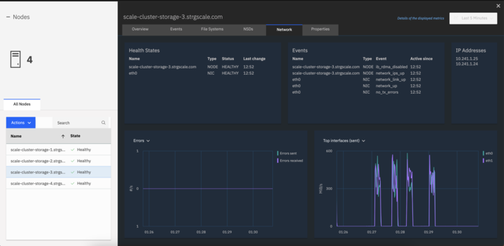

---

copyright:
  years: 2022, 2023
lastupdated: "2023-03-07"

keywords: 

subcollection: hpc-spectrum-scale

---

{:shortdesc: .shortdesc}
{:codeblock: .codeblock}
{:screen: .screen}
{:external: target="_blank" .external}
{:pre: .pre}
{:tip: .tip}
{:note: .note}
{:important: .important}
{:faq: data-hd-content-type='faq'}

# FAQs
{: #spectrum-scale-faqs}

## What locations are available for deploying VPC resources that make up the Spectrum Scale cluster?
{: #locations-vpc-resources}
{: faq}

Available regions and zones for deploying VPC resources and a mapping of those regions and zones to city locations and data centers can be found in [Locations for resource deployment](/docs/overview?topic=overview-locations){: external}. While any of the available regions can be used, resources are provisioned only in a single availability zone within the selected region.

## What permissions do I need in order to create a cluster that uses the offering?
{: #permissions-cluster-offering}
{: faq}

Instructions for the appropriate permissions for {{site.data.keyword.cloud_notm}} services that are used by the offering for creating a cluster can be found in Granting user permissions for VPC resources, Managing user access for Schematics, Assigning access to Secrets Manager, and [Creating trusted profiles](/docs/account?topic=account-create-trusted-profile).

## How do I SSH among nodes?
{: #ssh-among-nodes}
{: faq}

The {{site.data.keyword.scale_full_notm}} solution consists of two separate clusters (storage and compute). The SSH key parameter that is provided through {{site.data.keyword.bpshort}} (`storage_cluster_key_pair` and `compute_cluster_key_pair`) can be used to log in to the respective cluster nodes. You can log in to any node only through the bastion host by using the following command:

```shell
ssh -ubuntu@<IP_address_bastion_host>vpcuser@<IP-address-of-nodes>
```
{: pre}

Although all of the nodes of each cluster have passwordless SSH set up among them, due to security constraints, you can't directly log in to a node from one cluster to another cluster.
{: note}

When the secondary network is configured on the compute cluster, use this command to do ssh: **ssh -J ubuntu@<IP_address_bastion_host> vpcuser@<IP_address_secondary_interface>**.
{: note}

## How many compute and storage nodes can I deploy in my Spectrum Scale cluster through this offering?
{: #how-many-compute-storage-nodes}
{: faq}

Before you deploy a cluster, it is important to ensure that the VPC resource quota are appropriate for the size of the cluster that you would like to create (see [Quotas and service limits](/docs/vpc?topic=vpc-quotas)).

See the following minimum and maximum number of nodes that are supported in a cluster:
* Compute nodes: For all storage clusters, a minimum of 3 and a maximum of 64 virtual server instance compute nodes are supported.
* Scratch and evaluation cluster storage nodes: For a scratch and evaluation storage clusters, a minimum of 3 and a maximum of 18 virtual server instance storage nodes are supported.
* Persistent cluster storage nodes: For a persistent storage cluster, a minimum of 3 and a maximum of 10 bare metal server storage nodes are supported.

For more information, see [Deployment values](/docs/hpc-spectrum-scale?topic=hpc-spectrum-scale-deployment-values).

## What storage types are available through this offering? 
{: #storage-types-scale-offering}
{: faq}

The {{site.data.keyword.scale_short}} solution offers three different storage types: scratch, persistent, and evaluation. For more information, see [Storage types](/docs/hpc-spectrum-scale?topic=hpc-spectrum-scale-storage-types).

Parallel vNIC is not supported on the persistent storage type.
{: note}

## Why are there two different resource group parameters that can be specified in the IBM Cloud catalog tile?
{: #resource-group-parameters}
{: faq}

The first resource group parameter entry in the **Configure your workspace** section in the {{site.data.keyword.cloud_notm}} catalog applies to the resource group where the {{site.data.keyword.bpshort}} workspace is provisioned on your {{site.data.keyword.cloud_notm}} account. The value for this parameter can be different than the one used for the second entry in the **Parameters with default values** section in the catalog. The second entry applies to the resource group where VPC resources are provisioned.

## Where are the Terraform files used by the IBM Spectrum Scale tile located?
{: #terraform-file-location}
{: faq}

The Terraform-based templates can be found in this [GitHub repository](https://github.com/IBM/ibm-spectrum-scale-ibm-cloud-schematics){: external}.

## Where can I find the custom image name to image ID mappings for each cloud region?
{: #custom-image-mappings}
{: faq}

The mappings can be found in the `image-map.tf` file in this [GitHub repository](https://github.com/IBM/ibm-spectrum-scale-ibm-cloud-schematics){: external}.

## Can I use my own custom image in the Spectrum Scale cluster by specifying the image name in the deployment value `bootstrap_osimage_name`?
{: #bring-own-custom-image}
{: faq}

No, you can't use your own custom image for the bootstrap node currently. The bootstrap node image is configured with all of the required functions to setup the {{site.data.keyword.scale_short}} compute and storage resources.

## Can I connect directly through SSH to the bootstrap, compute, or storage nodes from a system external to IBM Cloud?
{: #connecting-nodes-external}
{: faq}

No, any SSH connection to the bootstrap, compute, or storage nodes is only possible through the bastion node for security reasons. You would use the following command to connect to your bootstrap, compute, or storage nodes (the IP address is specific to your particular node): `ssh -J ubuntu@<bastion_IP_address> vpcuser@<IP_address>`

## Can I establish an SSH connection between compute and storage nodes?
{: #establish-connection-between-nodes}
{: faq}

The compute and storage clusters are created to not have the same passwordless SSH keys. This ensures that there are separate administration domains for the compute and storage clusters; therefore, SSH between nodes from different clusters is not possible.

## Does the Spectrum Scale offering support multiple `key_pairs` to establish SSH to all of the nodes?
{: #multiple-key-pairs}
{: faq}

No, the current version of the {{site.data.keyword.scale_short}} offering supports only a single `key_pair` that can be provided for access to all of the nodes that are part of the cluster.

## Can I use my own resource group to configure the resources?
{: #resource-group-configure-resources}
{: faq}

Yes, you can provide the resource group of your choice for the deployment of your cluster's VPC resources. Due to the use of trusted profiles in this offering, you must ensure that all of the `key_pair` values that are specified in the deployment values are created in the same resource group.

## Which operating system versions are supported for the images used for the compute and storage nodes in Spectrum Scale?
{: #supported-operating-systems}
{: faq}

With {{site.data.keyword.scale_short}}, you can use custom or stock images based on RHEL 7.9 or RHEL 8.4. For compute nodes, both RHEL 7.9 or 8.4 can be used. For storage nodes, only RHEL 8.4 is supported.

## Why does Spectrum Scale not allow use of the default value of 0.0.0.0/0 for security group creation?
{: #default-value-security-group-creation}
{: faq}

For security reasons, {{site.data.keyword.scale_short}} does not allow you to provide a default value that would allow network traffic from any external device. Instead, you can provide the address of your user system (for example, by using https://ipv4.icanhazip.com/) or a multiple IP address range.

## What is an IBM Customer Number and what happens if I don't provide it?
{: #provide-icn}
{: faq}

An {{site.data.keyword.IBM_notm}} Customer Number (ICN) is the unique number that {{site.data.keyword.IBM_notm}} issues its customers during the post-contract signing process. The ICN is important because it allows {{site.data.keyword.IBM_notm}} to identify your company and support contract. Without an ICN, you can't deploy the {{site.data.keyword.scale_short}} resources through {{site.data.keyword.bplong_notm}}.

If the `storage_type` deployment value is set as either "scratch" or "persistent", the ICN can't be set as an empty value. An empty value is accepted only if the `storage_type` is set as "evaluation".
{: important}

## Can I directly destroy all Spectrum Scale resources from the CLI?
{: #destroy-resources-cli}
{: faq}

Do not destroy all of the resources from the CLI directly. The required resources that configure the {{site.data.keyword.scale_short}} cluster are created in two different phases of automation. To cleanly destroy a cluster, see [Destroying resources](/docs/hpc-spectrum-scale?topic=hpc-spectrum-scale-deleting-resources&interface=cli).

## What are trusted profiles and what permissions are required to set up the offering?
{: #trusted-profiles-required-permissions}
{: faq}

With {{site.data.keyword.scale_short}}, trusted profiles are used to set up granular authorization for applications that are running in compute resources. Therefore, you are not required to create or use service IDs or API keys for the creation of compute resources.

The required set of permissions to create the compute resources are already added as part of the automation code. For more information, see [Creating trusted profiles](/docs/account?topic=account-create-trusted-profile).

## Why did the destroy process fail to remove resources?
{: #failed-destroy}
{: faq}

There are a few potential reasons why the destroy process failed to remove resources:

* The input parameter from the deployment value might have been changed for some reason and {{site.data.keyword.bpshort}} is looking for the existing value. Mismatch of values might cause the destroy action to fail.
* If other resources are manually created after deployment of the VPC and subnets through the offering and those resources are associated with the same VPC, the destroy action would fail. 
* There might be issues on the {{site.data.keyword.cloud_notm}} infrastructure side that cause the destroy action to fail.

## Why am I not able to see my data on the shared file system storage after stopping the storage nodes?
{: #not-able-to-see-data}
{: faq}

The {{site.data.keyword.scale_full_notm}} file system data resides on instance storage. In general, data that is stored on instance storage is ephemeral so stopping the storage node results in data loss. However, instance storage data is not lost when an instance is rebooted. For more information, see [Lifecycle of instance storage](/docs/vpc?topic=vpc-instance-storage#instance-storage-lifecycle).

## Why do I see `xxxhiddenxxx` in the deployment output log instead of a variable name that I provided?
{: #variable-name-issue}
{: faq}

The solution provides useful information in the Terraform output log regarding the cluster and how to access cluster nodes (for example, SSH command, region, trusted profile ID, etc.n). 

The solution is integrated with the {{site.data.keyword.cloud_notm}} catalog tile, and input that is provided there triggers {{site.data.keyword.bpshort}} to deploy the VPC resources that form the cluster. When the system is passing sensitive information such as username and password, if that value matches with data in the deployment logs, {{site.data.keyword.bpshort}} outputs the value as `xxxhiddenxxx` according to an implemented security policy.

## When does secondary vNIC get enabled?
{: #secondary-vnic-enabled}
{: faq}

As part of parallel vNIC functionality, if a VSI profile has a Bandwidth Cap (Gbps) that is greater than or equal to 64 gbps, then the secondary network interface comes up and supports both compute and storage profiles. For more information, see [Instance Profiles](/docs/vpc?topic=vpc-profiles&interface=ui).

If a profile of compute nodes has a Bandwidth greater than or equal to 64 gbps, then the secondary network interface comes up on the compute cluster and scale gets configured on the secondary network interface.

If a profile of storage nodes has a Bandwidth greater than or equal to 64 gbps, then the secondary network interface comes up on the storage cluster and scale gets configured on the primary network interface.

## What is MROT?
{: #what-is-mrot}
{: faq}

The Multi-Rail over TCP (MROT) feature enables the concurrent use of multiple subnets to communicate with a specified destination, and allows the concurrent use of multiple physical network interfaces without requiring bonding to be configured.

MROT configuration gets configured only when both storage and compute cluster VSI profiles have Bandwidth more than or equal to 64 gbps and secondary is up and running.

For more information, see [Configuring Multi-Rail over TCP (MROT)](https://www.ibm.com/docs/en/storage-scale/5.1.8?topic=configuring-multi-rail-over-tcp-mrot.)

## How do I check that MROT and Logical subnet are configured?
{: #are-mrot-logical-configured}
{: faq}

To check if MROT and logical subnet are configured, use the **mmdiag --network** and **mmlsconfig** commands. For more information, see [mmdiag command](https://www.ibm.com/docs/en/storage-scale/5.1.8?topic=reference-mmdiag-command) and [mmlsconfig](https://www.ibm.com/docs/en/storage-scale/5.1.8?topic=reference-mmlsconfig-command).
 
### Example - mmdiag--network for the Compute Cluster
{: #example-mmdiag-network-compute}

The logical subnet can be seen under *my addr list*. In this example, under **hostname** and **idx** the hostnames, nodes, and destination IPs can be found.

For compute, cluster scale is configured only on secondary IP, so only secondary IPs are shown in the result. Individually for each node, details are shown under Connection details. The IpPair Table shows the source ip and destination ip.

   ```shell
   [root@scale-cluster-compute-1 ~]# mmdiag --network

   === mmdiag: network ===

   Pending messages:
     (none)
   Inter-node communication configuration:
     tscConnMode     mrot
     tscTcpPort      1191
     my address      10.241.1.22/24 (eth1) <c0n0>
     my addr list    10.241.1.22/24 (eth1)/scale-cluster.compscale.com;scale-cluster.strgscale.com
     my subnet list  10.241.1.0/24
     my node number  1
   TCP Connections between nodes:
    hostname                            node     idx destination     status     err  sock  sent(MB)  recvd(MB)  ostype
    scale-cluster-compute-3-sec         <c0n1>     0 10.241.1.21     connected  0    124   0         0          Linux/L
    scale-cluster-compute-3-sec         <c0n1>     1 10.241.1.21     connected  0    127   0         0          Linux/L
    scale-cluster-compute-2-sec         <c0n2>     0 10.241.1.19     connected  0    125   0         0          Linux/L
    scale-cluster-compute-2-sec         <c0n2>     1 10.241.1.19     connected  0    128   0         0          Linux/L
    scale-cluster-compute-4-sec         <c0n3>     0 10.241.1.20     connected  0    126   0         0          Linux/L
    scale-cluster-compute-4-sec         <c0n3>     1 10.241.1.20     connected  0    108   0         0          Linux/L
    scale-cluster-storage-1             <c1n0>     0 10.241.1.26     connected  0    134   0         0          Linux/L
    scale-cluster-storage-1             <c1n0>     1 10.241.1.23     connected  0    135   0         0          Linux/L
    scale-cluster-storage-3             <c1n1>     0 10.241.1.24     connected  0    137   0         0          Linux/L
    scale-cluster-storage-3             <c1n1>     1 10.241.1.25     connected  0    138   0         0          Linux/L
    scale-cluster-storage-2             <c1n2>     0 10.241.1.30     connected  0    136   0         0          Linux/L
    scale-cluster-storage-2             <c1n2>     1 10.241.1.27     connected  0    140   0         0          Linux/L
    scale-cluster-storage-4             <c1n3>     0 10.241.1.29     connected  0    133   0         0          Linux/L
    scale-cluster-storage-4             <c1n3>     1 10.241.1.28     connected  0    117   0         0          Linux/L
   Connection details:
     <c0n1> 10.241.1.21/0 (scale-cluster-compute-3-sec)
       status connected was_broken 0 err 0 reconnEnabled 1 delayedAckEnabled 1
       connMode mrot shutting 0 handlerCount 0 need_notify 0 leaseSentOn 1
       nMaxTcpConns 2 (2) nActiveCount 2 nActiveState 0x3 (1100000000000000)
       nInuseTcpConns 0 currTcpConnIndex 0 availableTcpConns (1111111111111111)
       nReservedSmallMsgTcpConns 0 currSmallMsgTcpConnIndex 0 currLargeMsgTcpConnIndex 0
       reconnectTcpConns (0000000000000000) disconnectTcpConns (0000000000000000)
       Inuse owner:
         [ 0]:0          [ 1]:0          [ 2]:0          [ 3]:0        
         [ 4]:0          [ 5]:0          [ 6]:0          [ 7]:0        
         [ 8]:0          [ 9]:0          [10]:0          [11]:0        
         [12]:0          [13]:0          [14]:0          [15]:0        

       IpPair Table (offset 0 [555/0/1]):
         idx iface           status ping_cnt source          destination     subnet
           0 eth1                up        0 10.241.1.22     10.241.1.21     10.241.1.0/24

   ```

### Example of mmlsconfig for Compute cluster
{: #example-mmlsconfig-network-compute}

In the **mmlsconfig** output, the subnet parameter is found in the list of configuration parameters.

For example, `subnets 10.241.1.0/scale-cluster.compscale.com;scale-cluster.strgscale.com`

### Example of mmdiag for Storage cluster
{: #example-mmdiag-network-storage}

On the storage cluster:

   ```shell
   [root@scale-cluster-storage-1 ~]# mmdiag --network

   === mmdiag: network ===

   Pending messages:
     (none)
   Inter-node communication configuration:
     tscConnMode     mrot
     tscTcpPort      1191
     my address      10.241.1.23/24 (eth0) <c0n0>
     my addr list    10.241.1.23/24 (eth0)/scale-cluster.strgscale.com;scale-cluster.compscale.com  10.241.1.26/24 (eth1)/scale-cluster.strgscale.com;scale-cluster.compscale.com
     my subnet list  10.241.1.0/24
     my node number  1
   TCP Connections between nodes:
    hostname                            node     idx destination     status     err  sock  sent(MB)  recvd(MB)  ostype
    scale-cluster-storage-3             <c0n1>     0 10.241.1.25     connected  0    126   0         0          Linux/L
    scale-cluster-storage-3             <c0n1>     1 10.241.1.24     connected  0    130   0         0          Linux/L
    scale-cluster-storage-2             <c0n2>     0 10.241.1.27     connected  0    127   0         0          Linux/L
    scale-cluster-storage-2             <c0n2>     1 10.241.1.30     connected  0    131   0         0          Linux/L
    scale-cluster-storage-4             <c0n3>     0 10.241.1.28     connected  0    124   0         0          Linux/L
    scale-cluster-storage-4             <c0n3>     1 10.241.1.29     connected  0    133   0         0          Linux/L
    scale-cluster-compute-1-sec         <c0n4>     0 10.241.1.22     connected  0    128   0         0          Linux/L
    scale-cluster-compute-1-sec         <c0n4>     1 10.241.1.22     connected  0    137   0         0          Linux/L
    scale-cluster-compute-4-sec         <c0n5>     0 10.241.1.20     connected  0    138   0         0          Linux/L
    scale-cluster-compute-4-sec         <c0n5>     1 10.241.1.20     connected  0    141   0         0          Linux/L
    scale-cluster-compute-3-sec         <c0n6>     0 10.241.1.21     connected  0    139   0         0          Linux/L
    scale-cluster-compute-3-sec         <c0n6>     1 10.241.1.21     connected  0    143   0         0          Linux/L
    scale-cluster-compute-2-sec         <c0n7>     0 10.241.1.19     connected  0    140   0         0          Linux/L
    scale-cluster-compute-2-sec         <c0n7>     1 10.241.1.19     connected  0    142   0         0          Linux/L
   Connection details:
     <c0n1> 10.241.1.24/0 (scale-cluster-storage-3)
       status connected was_broken 0 err 0 reconnEnabled 1 delayedAckEnabled 1
       connMode mrot shutting 0 handlerCount 0 need_notify 0 leaseSentOn 1
       nMaxTcpConns 2 (2) nActiveCount 2 nActiveState 0x3 (1100000000000000)
       nInuseTcpConns 0 currTcpConnIndex 1 availableTcpConns (1111111111111111)
       nReservedSmallMsgTcpConns 0 currSmallMsgTcpConnIndex 0 currLargeMsgTcpConnIndex 0
       reconnectTcpConns (0000000000000000) disconnectTcpConns (0000000000000000)
       Inuse owner:
         [ 0]:0          [ 1]:0          [ 2]:0          [ 3]:0        
         [ 4]:0          [ 5]:0          [ 6]:0          [ 7]:0        
         [ 8]:0          [ 9]:0          [10]:0          [11]:0        
         [12]:0          [13]:0          [14]:0          [15]:0        

       IpPair Table (offset 1 [559/0/2]):
         idx iface           status ping_cnt source          destination     subnet
           0 eth0                up        0 10.241.1.23     10.241.1.24     10.241.1.0/24
           1 eth1                up        0 10.241.1.26     10.241.1.25     10.241.1.0/24

   ```

### Example - mmlsconfig Storage cluster
{: #example-mmlsconfig-network-storage}

In the **mmlsconfig** output, the subnet parameter is found in the list of configuration parameters.

For example, `subnets 10.241.1.0/scale-cluster.strgscale.com;scale-cluster.compscale.com``.

## What is the MTU value set on both interfaces?
{: #mtu-values-both}

On both interfaces, MTU value should be 9000. It can be validated by the **ifconfig** command or by sending packets by the **ping -I eth1 -s 8972** command.

## How does communication happen between the clusters?
{: #communication-between-clusters}

For the Compute cluster, the primary interface is used only for application communication. Secondary interface is used for scale communication as scale got configured on secondary interface. Primary interface cannot ping scale nodes, while the secondary interface can ping scale nodes on the primary and secondary interface (ping -I eth1).

For the Storage cluster, both primary and secondary interfaces are used for scale traffic. Communication happens between primary and secondary interface of storage cluster to secondary interface of compute cluster if it has two network interfaces because scale gets configured on secondary network interface in compute cluster.

## What version of scale supports MROT configuration?
{: #support-mrot-versions}

Anything above IBM Spectrum Scale 5.1.5 supports the Multi-Rail over TCP (MROT) feature.

## What version of OS does Scale support?
{: #os-version-supported}

With Spectrum Scale, you can use custom or stock images based on RHEL 7.9 or RHEL 8.6. For compute nodes, both RHEL 7.9 or 8.6 can be used. For storage nodes, only RHEL 8.6 is supported.

## How to Analyse the GUI Dashboard for traffic Flow
{: #analyze-gui-dashboard}

To analyse traffic flow on the GUI dashboard, log in to any of the compute nodes and run this script:

   ``` shell
    #!/bin/bash

    dd if=/dev/zero of=/gpfs/fs1/hostname.out bs=4M count=10000 > /gpfs/fs1/hostname.log 2>&1

    dd if=/gpfs/fs1/hostname.out of=/dev/null bs=4M count=9000 >> /gpfs/fs1/hostname.log 2>&1 
   ```

Now login to the GUI dashboard for the storage cluster and check the cluster/Network section of the storage nodes. Click on any of the nodes. Traffic should be receiving on all the nodes of primary and secondary interfaces.

{: caption="Figure 1. GUI dashboard" caption-side="bottom"}

You can also use the **netstat -in** command to see counters. 

There might be a difference in counters in the primary and secondary nodes. But counters will increase in the same ratio.
{: note}

   ``` shell
    # netstat -in
    Kernel Interface table
    Iface             MTU    RX-OK RX-ERR RX-DRP RX-OVR    TX-OK TX-ERR TX-DRP TX-OVR Flg
    eth0             9000  1592545      0      0 0       1329588      0      0      0 BMRU
    eth1             9000  1348741      0      0 0        936947      0      0      0 BMRU
    lo              65536   586890      0      0 0        586890      0      0      0 LRU##
   ```


