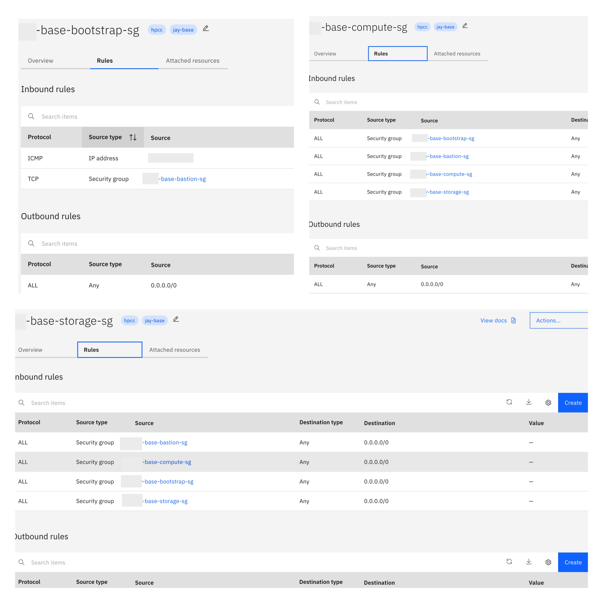

---

copyright:
  years: 2025
lastupdated: "2025-03-14"

keywords:

subcollection: storage-scale

---

{:shortdesc: .shortdesc}
{:codeblock: .codeblock}
{:screen: .screen}
{:external: target="_blank" .external}
{:pre: .pre}
{:tip: .tip}
{:note: .note}
{:important: .important}
{:faq: data-hd-con
{:step: data-tutorial-type='step'}
{:table: .aria-labeledby="caption"}

# Storage Scale Security Groups
{: #security-groups}

The {{site.data.keyword.scale_full_notm}} deployment currently supports the creation of new security groups through the automation process. This automated setup provisions distinct security groups customized for different node types such as bastion, storage, and bootstrap security group. Additionally, when optional features are enabled, the automation creates specific security groups: ldap for LDAP integration, gklm for Guardium Key Lifecycle Manager (GKLM), and comp for Compute Nodes.

Each security group is dedicated to a specific set of scale nodes, ensuring that only the necessary ports, sources, and destinations are enabled for those nodes. This approach minimizes exposure, enhances security, and reduces the risk of misconfigurations.

When using the Storage Scale automation, the required security groups and their associated rules are automatically created and applied. However, if users prefer to utilize pre-existing security groups, they must ensure that at least three default security groups `bastion_sg_name`, `strg_sg_name`, and `bootstrap_sg_name` are provided for the clusters core functionality. Depending on the optional features enabled, the respective additional security groups (`ldap_sg_name`, `gklm_sg_name`, and `comp_sg_name`) must also be provided.

For best practices, it is recommended to use separate and dedicated security groups for each respective scale node type. This approach ensures consistent security policies across all resources and simplifies management by reducing the risk of policy conflicts and misaligned configurations.

When users opt for the existing security groups, they must ensure that all necessary groups are specified. Failure to provide the required security groups will result in automation failure.

**Scenario 1**

If user is using an existing security groups, then they must ensure that at least three default security groups `bastion_sg_name`, `strg_sg_name`, and `bootstrap_sg_name` are provided for the clusters core functionality. Depending on the optional features enabled, the respective additional security groups (`ldap_sg_name`, `gklm_sg_name`, and `comp_sg_name`) must also be provided.

For example, if the user wants to create only storage and compute clusters with `enable_sg_validation` variable set to `true` and provides only the `bastion_sg_name`, `comp_sg_name`, and `bootstrap_sg_name` variables omitting the `strg_sg_name`, then the terraform automation fails due to built-in validations designed to ensure all mandatory security groups are passed for cluster creation.

This validation is applicable on all security groups.
{: note}

```console
2025/03/12 10:30:01 Terraform plan | Call to function "regex" failed: pattern did not match any part of the given
 2025/03/12 10:30:01 Terraform plan | string.
 2025/03/12 10:30:01 Terraform plan |
 2025/03/12 10:30:01 Terraform plan | Error: Error in function call
 2025/03/12 10:30:01 Terraform plan |
 2025/03/12 10:30:01 Terraform plan |   on input-validations.tf line 537, in locals:
 2025/03/12 10:30:01 Terraform plan |  537:   validate_strg_sg_chk = regex("^${local.strg_sg_msg}$", local.validate_strg_sg ? local.strg_sg_msg : "")
 2025/03/12 10:30:01 Terraform plan |     ├────────────────
 2025/03/12 10:30:01 Terraform plan |     │ while calling regex(pattern, string)
 2025/03/12 10:30:01 Terraform plan |     │ local.strg_sg_msg is "Only new or existing security groups are supported. If any security group name is not null, then strg_sg_name must be an existing security group."
 2025/03/12 10:30:01 Terraform plan |     │ local.validate_strg_sg is false
 2025/03/12 10:30:01 Terraform plan |
 2025/03/12 10:30:01 Terraform plan | Call to function "regex" failed: pattern did not match any part of the given
 2025/03/12 10:30:01 Terraform plan | string.
 2025/03/12 10:30:01 T
```
{: pre}

{: caption="Security Groups" caption-side="bottom"}

**Scenario 2**

If the variable `enable_sg_validation` is set to `false`, then the automation bypasses these security group validations as mentioned in **Scenario 1**. This allows the deployment to proceed further with cluster creation. This will lead the cluster deployment to fail during the terraform apply, causing the virtual server instance unable to attach to the dedicated security group association.

When the `enable_sg_validation` is set to `false`, then the validations are skipped increasing the risk of misconfigurations that could prevent the cluster from operating as expected and it requires an additional debugging.

{: caption="Security Group Inbound and Outbound rules" caption-side="bottom"}

It is expected that the rules for the Security Groups must look similar as above.

You must either use new security groups created by the automation or depend on the pre-existing ones. A mixed approach combining both new and existing security groups is not supported and can lead to inconsistent configurations and potential security vulnerabilities.
{: important}

| Variable	|Description	| Value |
|----------|----------|----------|
|`enable_sg_validation`| If `enable_sg_validation` is set to true, the deployment confirms that the correct security groups are attached and allows the appropriate rules. When set to false, no validation is performed, and the deployment proceeds without verifying the security groups. | true |
|`bastion_sg_name`| Provide the security group name to provision the bastion node. If set to `null`, the solution will automatically create the necessary security group and rules. If you choose to use an existing security group, ensure it has the appropriate rules configured for the bastion node to function properly. | Null |
|`bootstrap_sg_name`| Provide the security group name to provision the bootstrap node. If set to `null`, the solution will automatically create the necessary security group and rules. If you choose to use an existing security group, ensure it has the appropriate rules configured for the bootstrap node to function properly. | Null |
|`strg_sg_name`| Provide the security group name to provision the storage nodes. If set to `null`, the solution automatically creates the necessary security group and rules. If you choose to use an existing security group, ensure it has the appropriate rules configured for the storage nodes to function properly. | Null |
|`comp_sg_name`| Provide the security group name to provision the compute nodes. If set to `null`, the solution will automatically create the necessary security group and rules. If you choose to use an existing security group, ensure it has the appropriate rules configured for the compute nodes to function properly. | Null |
|`gklm_sg_name`| Provide the security group name to provision the gklm nodes. If set to `null`, the solution will automatically create the necessary security group and rules. If you choose to use an existing security group, ensure it has the appropriate rules configured for the gklm nodes to function properly. | Null |
|`ldap_sg_name`| Provide the security group name to provision the ldap nodes. If set to `null`, the solution will automatically create the necessary security group and rules. If you choose to use an existing security group, ensure it has the appropriate rules configured for the ldap nodes to function properly. | Null |
{: caption="Security Group Validation" caption-side="bottom"}
