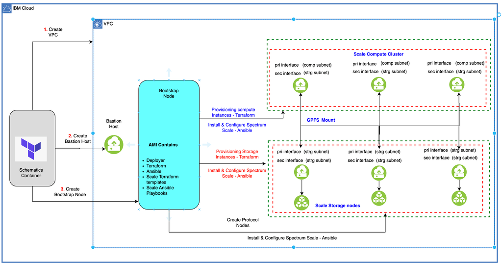

---

copyright:
  years: 2022, 2023
lastupdated: "2023-09-20"

keywords: 

subcollection: hpc-spectrum-scale

---

{:shortdesc: .shortdesc}
{:codeblock: .codeblock}
{:screen: .screen}
{:external: target="_blank" .external}
{:pre: .pre}
{:tip: .tip}
{:note: .note}
{:beta: .beta}
{:important: .important}


# Enabling Parallel vNIC
{: #enabling-vnic}

## About
{: #about-vnic}

A vNIC (Virtual Network Interface Controller) is a virtual representation of a physical network interface card. In cloud environments, vNICs are associated with virtual machines (VMs) and serve as the primary means of communication between the VM and the underlying network infrastructure. Each VM typically has one or more vNICs that enable it to send and receive data over the network. For more information, see: https://cloud.ibm.com/docs/vpc?topic=vpc-using-instance-vnics.

As per parallel vNIC support for each node of a compute and storage cluster, a secondary vNIC comes up based on the bandwidth of a profile. According to the parallel vNIC functionality, if a VSI profile has a Bandwidth Cap (Gbps) of 64 Gbps or more, then a secondary network interface is activated. This functionality is supported on both compute and storage profiles. For more details about the VSI profile, see: https://cloud.ibm.com/docs/vpc?topic=vpc-profiles&interface=ui.

If the profile of compute nodes has a Bandwidth of 64 Gbps or more, a secondary network interface is activated only on the compute cluster, and scale will be configured on the secondary network interface.

Compute vNICs are connected to two different subnets, providing network segmentation and isolation between application traffic and storage traffic. This setup enhances security and efficiency by keeping these types of traffic separate and ensuring that each subnet serves its dedicated purpose. The primary interface of the compute cluster is dedicated to application communication. The secondary interface is utilized for scale communication as scale is configured on the secondary interface.

Similarly, if the profile of storage nodes has a Bandwidth of 64 Gbps or more, a secondary network interface is activated only on the storage cluster, and scale will be configured on the primary network interface. Storage vNICs are connected to the same subnets, handling scaled traffic. Both primary and secondary interfaces are dedicated to scale communication. Communication occurs between the primary and secondary interfaces of the storage cluster to the secondary interface of the compute cluster.

Parallel vNIC feature is not supported for persistent storage type.
{: note}

{: caption="Figure 1.  Install and Configure Storage Scale" caption-side="bottom"}

## Benefits
{: #benefits}

Parallel virtual network interface cards (vNICs) are beneficial for {{site.data.keyword.scale_full_notm}}.

### Parallelism and Load Balancing
{: #parallel-load-balance}

Load Distribution: With two vNICs, network traffic gets distributed between them, effectively balancing the load. This is beneficial in scenarios where there is a high volume of network traffic.

Parallel Processing: Multiple vNICs can handle network tasks in parallel, allowing for more efficient use of available bandwidth. This is similar to the concept of parallel processing in computing.

### Redundancy and Failover
{: #redendant-failover}

Network Redundancy: Two vNICs can provide network redundancy. If one network path or vNIC fails, the other can take over, ensuring continuous network connectivity. This is often implemented in environments where high availability is crucial.

Failover: In addition to redundancy, if one vNIC is overwhelmed or experiences issues, the traffic can be directed to the other vNIC, ensuring continuous operation.

### Improved Throughput
{: #improved-throughput}

Increased Aggregate Bandwidth: By using two vNICs, there is an essential increase in the aggregate bandwidth that the system can utilize. This is especially useful when dealing with applications or workloads that require high throughput.

### Traffic Isolation
{: #traffic-isolation}

Separation of Traffic Types: One vNIC can be used for specific types of traffic (for example, storage traffic), and the other for different types (for example, application traffic). This separation can prevent congestion on a single network path and improve overall performance.

## MROT
{: #mrot}

IBM Storage Scale 5.1.5 introduces the Multi-Rail over TCP (MROT) feature. This functionality allows the concurrent use of multiple subnets to communicate with a specified destination. It also permits the simultaneous utilization of multiple physical network interfaces without the need for bonding configuration.

MROT configuration occurs only when both the storage and compute cluster VSI profiles have a bandwidth equal to or greater than 64 Gbps, and the secondary vNIC is up and running. Learn more about MROT at {{site.data.keyword.scale_full_notm}} Documentation.

### Verification
{: #mrot-verification}

To verify the configuration of MROT and the logical subnet, use the following commands:

`mmdiag --network`

#### On Compute Cluster
{: #on-compute-cluster}

The logical subnet can be observed under my address list. In the example results, you can find the destination hostnames and IPs under the columns "hostname" and "idx."

For the compute cluster, scale is configured only on secondary IPs; hence, only secondary IPs are visible in the results. For detailed information on each node, refer to the "Connection Details" section. The IpPair Table displays the source IP and destination IP.
{: note}

Compute cluster

```
    [root@scale-cluster-compute-1 ~]# mmdiag --network

    === mmdiag: network ===

    Pending messages:
      (none)
    Inter-node communication configuration:
      tscConnMode     mrot
      tscTcpPort      1191
      my address      10.241.1.22/24 (eth1) <c0n0>
      my addr list    10.241.1.22/24 (eth1)/scale-cluster.compscale.com;scale-cluster.strgscale.com
      my subnet list  10.241.1.0/24
      my node number  1
    TCP Connections between nodes:
        hostname                            node     idx destination     status     err  sock  sent(MB)  recvd(MB)  ostype
        scale-cluster-compute-3-sec         <c0n1>     0 10.241.1.21     connected  0    124   0         0          Linux/L
        scale-cluster-compute-3-sec         <c0n1>     1 10.241.1.21     connected  0    127   0         0          Linux/L
        scale-cluster-compute-2-sec         <c0n2>     0 10.241.1.19     connected  0    125   0         0          Linux/L
        scale-cluster-compute-2-sec         <c0n2>     1 10.241.1.19     connected  0    128   0         0          Linux/L
        scale-cluster-compute-4-sec         <c0n3>     0 10.241.1.20     connected  0    126   0         0          Linux/L
        scale-cluster-compute-4-sec         <c0n3>     1 10.241.1.20     connected  0    108   0         0          Linux/L
        scale-cluster-storage-1             <c1n0>     0 10.241.1.26     connected  0    134   0         0          Linux/L
        scale-cluster-storage-1             <c1n0>     1 10.241.1.23     connected  0    135   0         0          Linux/L
        scale-cluster-storage-3             <c1n1>     0 10.241.1.24     connected  0    137   0         0          Linux/L
        scale-cluster-storage-3             <c1n1>     1 10.241.1.25     connected  0    138   0         0          Linux/L
        scale-cluster-storage-2             <c1n2>     0 10.241.1.30     connected  0    136   0         0          Linux/L
        scale-cluster-storage-2             <c1n2>     1 10.241.1.27     connected  0    140   0         0          Linux/L
        scale-cluster-storage-4             <c1n3>     0 10.241.1.29     connected  0    133   0         0          Linux/L
        scale-cluster-storage-4             <c1n3>     1 10.241.1.28     connected  0    117   0         0          Linux/L
    Connection details:
      <c0n1> 10.241.1.21/0 (scale-cluster-compute-3-sec)
        status connected was_broken 0 err 0 reconnEnabled 1 delayedAckEnabled 1
        connMode mrot shutting 0 handlerCount 0 need_notify 0 leaseSentOn 1
        nMaxTcpConns 2 (2) nActiveCount 2 nActiveState 0x3 (1100000000000000)
        nInuseTcpConns 0 currTcpConnIndex 0 availableTcpConns (1111111111111111)
        nReservedSmallMsgTcpConns 0 currSmallMsgTcpConnIndex 0 currLargeMsgTcpConnIndex 0
        reconnectTcpConns (0000000000000000) disconnectTcpConns (0000000000000000)
        Inuse owner:
          [ 0]:0          [ 1]:0          [ 2]:0          [ 3]:0        
          [ 4]:0          [ 5]:0          [ 6]:0          [ 7]:0        
          [ 8]:0          [ 9]:0          [10]:0          [11]:0        
          [12]:0          [13]:0          [14]:0          [15]:0        

        IpPair Table (offset 0 [555/0/1]):
          idx iface           status ping_cnt source          destination     subnet
            0 eth1                up        0 10.241.1.22     10.241.1.21     10.241.1.0/24
```

On the Compute cluster:

`subnets 10.241.1.0/scale-cluster.compscale.com;scale-cluster.strgscale.com`


#### On Storage Cluster
{: #on-storage-cluster}

The logical subnet is visible under my address list. In the results, you can find the destination hostnames of nodes and their corresponding destination IPs under the columns "hostname" and "idx."

For the storage cluster, scaling is configured on both primary and secondary IPs; hence, both primary and secondary IPs are visible in the results. For detailed information on each node, refer to the "Connection Details" section. The IpPair Table displays the source IP and destination IP.
{: note}

```
    
    [root@scale-cluster-storage-1 ~]# mmdiag --network

    === mmdiag: network ===

    Pending messages:
      (none)
    Inter-node communication configuration:
      tscConnMode     mrot
      tscTcpPort      1191
      my address      10.241.1.23/24 (eth0) <c0n0>
      my addr list    10.241.1.23/24 (eth0)/scale-cluster.strgscale.com;scale-cluster.compscale.com  10.241.1.26/24 (eth1)/scale-cluster.strgscale.com;scale-cluster.compscale.com
      my subnet list  10.241.1.0/24
      my node number  1
    TCP Connections between nodes:
        hostname                            node     idx destination     status     err  sock  sent(MB)  recvd(MB)  ostype
        scale-cluster-storage-3             <c0n1>     0 10.241.1.25     connected  0    126   0         0          Linux/L
        scale-cluster-storage-3             <c0n1>     1 10.241.1.24     connected  0    130   0         0          Linux/L
        scale-cluster-storage-2             <c0n2>     0 10.241.1.27     connected  0    127   0         0          Linux/L
        scale-cluster-storage-2             <c0n2>     1 10.241.1.30     connected  0    131   0         0          Linux/L
        scale-cluster-storage-4             <c0n3>     0 10.241.1.28     connected  0    124   0         0          Linux/L
        scale-cluster-storage-4             <c0n3>     1 10.241.1.29     connected  0    133   0         0          Linux/L
        scale-cluster-compute-1-sec         <c0n4>     0 10.241.1.22     connected  0    128   0         0          Linux/L
        scale-cluster-compute-1-sec         <c0n4>     1 10.241.1.22     connected  0    137   0         0          Linux/L
        scale-cluster-compute-4-sec         <c0n5>     0 10.241.1.20     connected  0    138   0         0          Linux/L
        scale-cluster-compute-4-sec         <c0n5>     1 10.241.1.20     connected  0    141   0         0          Linux/L
        scale-cluster-compute-3-sec         <c0n6>     0 10.241.1.21     connected  0    139   0         0          Linux/L
        scale-cluster-compute-3-sec         <c0n6>     1 10.241.1.21     connected  0    143   0         0          Linux/L
        scale-cluster-compute-2-sec         <c0n7>     0 10.241.1.19     connected  0    140   0         0          Linux/L
        scale-cluster-compute-2-sec         <c0n7>     1 10.241.1.19     connected  0    142   0         0          Linux/L
    Connection details:
      <c0n1> 10.241.1.24/0 (scale-cluster-storage-3)
        status connected was_broken 0 err 0 reconnEnabled 1 delayedAckEnabled 1
        connMode mrot shutting 0 handlerCount 0 need_notify 0 leaseSentOn 1
        nMaxTcpConns 2 (2) nActiveCount 2 nActiveState 0x3 (1100000000000000)
        nInuseTcpConns 0 currTcpConnIndex 1 availableTcpConns (1111111111111111)
        nReservedSmallMsgTcpConns 0 currSmallMsgTcpConnIndex 0 currLargeMsgTcpConnIndex 0
        reconnectTcpConns (0000000000000000) disconnectTcpConns (0000000000000000)
        Inuse owner:
          [ 0]:0          [ 1]:0          [ 2]:0          [ 3]:0        
          [ 4]:0          [ 5]:0          [ 6]:0          [ 7]:0        
          [ 8]:0          [ 9]:0          [10]:0          [11]:0        
          [12]:0          [13]:0          [14]:0          [15]:0        

        IpPair Table (offset 1 [559/0/2]):
          idx iface           status ping_cnt source          destination     subnet
            0 eth0                up        0 10.241.1.23     10.241.1.24     10.241.1.0/24
            1 eth1                up        0 10.241.1.26     10.241.1.25     10.241.1.0/24
```

On Storage Cluster:

`subnets 10.241.1.0/scale-cluster.strgscale.com;scale-cluster.compscale.com`

